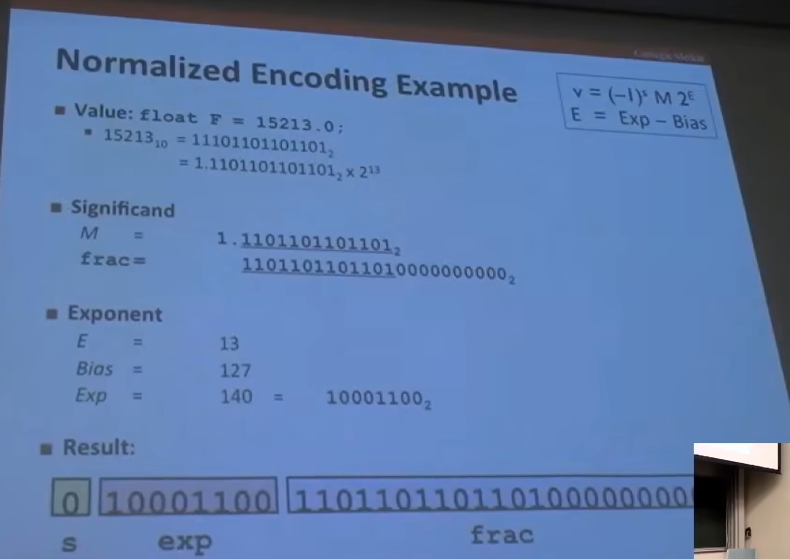
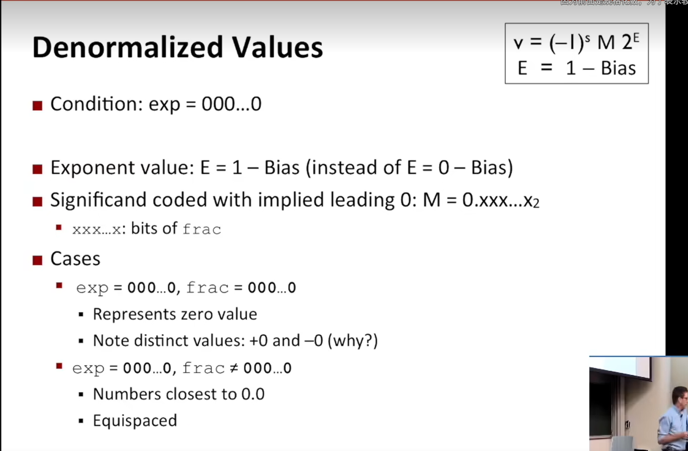
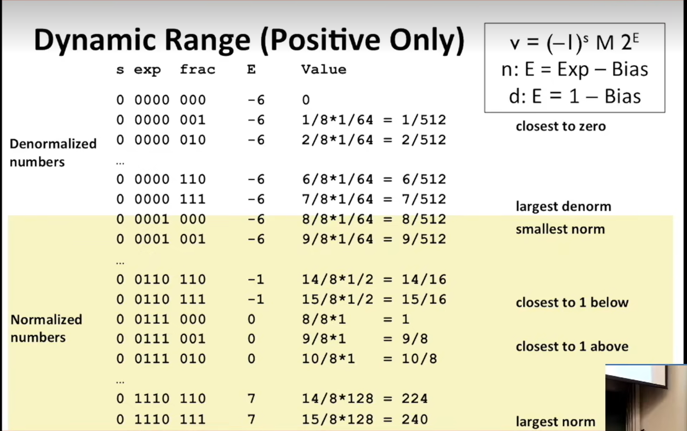

## float point  
浮点数的表示分为三个部分：符号（s），指数（E），尾数（m）有点类似于科学计数法  
---
value=(-1)^s* M * e^E  
---
规格化  
E = exp -Bias(偏置值)  
其中exp除去全0和全1  
single percision:Bias=127 exp ：1 ...254（除去全0和全1）  E:-126 ...127  
double percision : Bias=1023 exp:1...2046  E :-1022 ... 1023  
采用这种偏移值的办法的优点是便于比较指数位  
---
尾数的部分中有隐含的1，小数点前的个位数必然是1（免费获得一个位）  
M=1.xxxxxx...  
xxx...x:bits of frac field  
mini when frac=000000(M = 1.0)  
max when frac = 111111111..(M = 2-epsiro)(极限)  
eg.  
注意规格化表示无法表示0 ，因为尾数永远有1存在  
---
非规格化  
可以表示0
  
special：只有当指数域全为1时（一般时全为0）  
when 小数域全为0时，得到的值为无穷（符号取决于s） 无穷能够表示溢出的结果  
而当小数域不为0时，会返回NaN（Not a Number）  
一些运算的结果不为实数或者无穷，就会返回这样的NaN值，比如根号-1，或无穷-无穷）  
  
假如我们将图中的值的位表达式解释为无符号数，他就是按升序排序的，这并不是偶然的，时IEEE有意为之的（能够使用整数的排序函数来进行排序）  
---  
舍入：IEEE标准：向最近的的偶数舍入（取到中间的数的时候，一般情况都是向最近的整数舍入）  
因此，浮点数的运算（加法，乘法）往往不遵循结合律和分配律，因为大数加上小数有可能直接把小数舍弃  
但是满足单调性：if a>b , then x+a>x+b（这是无符号和二进制补码所没有的）  
预告：练习2.37以及新的章节：机器编程     